{: .box-note}
**Note:** Collaborator(s) - N/A

{: .box-note}
**Note:** The start of this project is the same as my qunatitave data project, as the data is still relevant and it allows my topic to fit more cleanly into a succinct and complete blog post

**This is my DP lab**

## Dinosaur Planes

The market size, measured by revenue, of the Global Airlines industry was around $841.4bn in 2023. In 2019, there were over 250 million keen flyers traveling in or from the US alone! That’s a lot of people. Yet despite the sheer volume of people flying nowadays, one key demographic has been left unable to fly due to the lack of consideration for accessibility: The Dinosaurs. Many dinosaurs are simply too big or heavy for a plane to carry. Why is this? Some people say this is because the dinosaurs are “extinct”, or because they are “animals” so why would they fly commercial? I disagree with this mentality. Accommodation is important for all and I have taken it upon myself to find a solution to this problem. How can we make commercial flight easily available for the Dinosaurs? How can we make … a Dinosaur plane?

The first step we must take is deciding what dinosaur to use.
Dinosaurs come in a wide variety of shapes and sizes but a specific species makes it easy to consider measurements and estimate values. For our first steps in dinosaur plane construction I think it best to consider a dinosaur more similar to humans, rather than going for the hardest dinosaurs immediately. A velociraptor might seem like a simple easy choice, but it's a bit small. Anything below the size of 3 humans is somewhat pointless to analyze as we could fit them in three aisle seats or stow them as pets. Among the dinosaurs, a T Rex is fairly similar to a human, just scaled up with tiny arms. It’s bipedal and  has an arm length of 3ft. half an average human's wingspan is roughly 3ft (with rounding), so pretty similar arm sizes. Also it’s a T Rex.
Calculations

Now, according to the first and second internet results a T Rex would weigh around 5000 kg to 7000 kg. Wikipedia also says 8.87 metric tons (1 metric ton = 1000 kg). A T Rex is about 11-12 meters long, 1.6-1.9 meters wide, and 3.66-3.96 meters tall (to the hips). This is a wide range of masses and lengths so let’s use whatever’s easiest for us (the lightest and smallest measurements). We can always ask the Rexes to cut down on some weight, tuck their tails in and to lie down.
Also for any human references we will be using a cuboid of dimensions 1.76 meters tall,  0.41 meters wide, and 0.18 meters long.

### Accommodations
Before we get into planes let’s quickly consider some of the accommodations for the Rexes.
Economy class chairs typically weigh around 8-15 kg (18-33 lb.). To scale up from human height to Rex length, we have to multiply by a factor of 6.25, from human width to Rex width, we have to multiply by a factor of 3.9, and for human length to Rex height, we have to multiply by a factor of 20.34. The total scale factor to get the Rex weight is therfore 495.7875 times the human weight. This means we can estimate the seat weight to be 3967.48 kg.
If we want to have a high class commercial plane line we might also want to include some flight food. National Geographic has stated that a T Rex ate 227 kilograms of meat per day. The average plane meal for humans contains around 360 calories, which is 14.4% of a human’s daily intake. For a Rex the proportional amount of meat would then be 32.688 kg.

### Plane 1 - The Real Plane
To start off, let’s consider using a pre-existing plane. The largest plane ever built, a cargo plane, was the Antonov An-225 Mriya. Officially the plane had a max cargo capacity of 200,000kg. By pure mass calculations this means as many as 40 Rexes. That’s not a lot of Rexes. Even worse, the cargo space itself is 6.4 meters wide and 43.5 meters long. So the amount of space for Rexes can fit is 3.9 along the length (if they fold their tails a little we can round to 4) and 4 along the width. That’s around 16 Rexes in the cargo bay. That number is abysmal and sad. This doesn’t even include a seating space or walking area, this is stacking them right next to each other, lying down. Seats would be too heavy and not fit due to height limitations. If we wanted to make space for an aisle, we’d have to reduce the number of dinosaurs to 12. With an hourly cost of $30,000 in flight (not including take-off preparation and loading), this plane would cost $2,500 per dino, per hour. With a cruise speed of 750 km/h, to cross from the US to the UK would be a distance of 6830.07 km. This would take 9.1 hours. For a Rex this travel would cost over $22,766. And unfortunately I don't think T Rexes are making that kinda money. Even if we forget about the aisle the cost per hour would be $1,875 per hour per dino.

How can we save on money then? While there may be many safety rules about humans, pets and even horses on flights, there are not so many for dinosaurs (in fact there are none! Don't fact check). With this we can make use of much unused, previously wasted space on the outside of the plane. This allows us to plaster the Rex on the outside of the plane instead of  having to store them in the cargo bay. The length of the fuselage is about 76.4 meters while the width and height is about 8 meters. If we were to assume the fuselage shape is cylindrical (which it isn't, it's more of a soft-edged cuboid that curves at the end), then the surface area ≈ 2(pi)(4)(76.4) = 1920 m^2. A Rex footprint was about 1 meter long and 0.46 m wide. So total foot area roughly equals 1 m^2 so the dinosaur capacity due to area is around 1,920 Rexes. But that still means only 40 Rexes due to the weight limit. Since we’re not caring about safety, why not also ignore the max cargo capacity? The max take-off weight is actually 640,000 kg, it’s just not a safe take-off weight. Minusing the weight of the plane (285,000 kg) and fuel (15,000 kg) allows for 350,000 kg of Rexes. That’s 70 Rexes! It’s the equivalent of a small plane for humans. Good enough for using a real plane.
Now obviously we can't just stick the Rexes on with magic. We have to use glue or rope to tie their feet down somehow. I think metal rope is the easiest to use and switch out Rexes with so the Rexes will be tightly fastened on with perfectly stable metal cable. I found some metal rope (https://expresswirerope.com/6x36-iwrc-galvanised-wire-rope.html) which costs £3.95 per meter. One circle of the plane in rope will be 25.13 meters, which would cost £99.28, and would be able to contain 15 Rexes. Since we have 16 Rexes in the cargo bay, we have 54 Rexes for the outside. These Rexes would need 4 circles of rope, raising the cost by £626.68. With this the cost per Rex would be between $428.57-442.86 per dino per hour of flight. Still quite expensive per Rex, but much less than prior. We can compensate for some of the less affluent Rexes by tripling the price of the cargo Rexes. They’ve got the best seats after all. If we do this we can also reduce the cost of regular outside seats and increase profits. If we set the regular seats to $300-$200, then the premium seats cost $862.5-$1200 to make even. To make a profit we should require $300/hour for regular, and $1200/hour for premium, giving us an estimated return of $5400/hour of flight. This is still hugely expensive. Even for the regular seats, to travel US to London would cost $2,730. Unfortunately this is as far as our real plane can take us. Unless we switch our commercial airline to a smuggling operation, it is doubtful that any rational Rex would be willing to pay such money.

### The Imaginary Plane(s)
For our first plane we have been considering a real plane that is guaranteed to work. But why? The reason we are constructing this technology is for innovation in the airline sector to open up to the new dinosauria market. While we may want to remain within the realms of feasibility, we can push the envelope in terms of transportation methods. For this reason we can consider two types of imaginary planes: Multiplanes and Gigaplanes. Using these planes we can hopefully set reasonable prices for tickets (I aim to set a ticket price of $500 for London to New York) for affordable Rex flight. Then we can also start to consider profit and our expected revenue from this business. The dinosaurs come first, but it doesn't hurt to consider our own interests.

Before Describing these two planar methods, we need some data to analyze. Both of these methods involve using real planes to create a hypothetical plane. Since they are both based on pre-existing planes, we need some data on real planes to compare what is the most effective for each method and determine how the real plane we are basing our imaginary planes on would affect our expected (theoretical) values. For this reason I have constructed a dataset (including data principally from wikipedia) on different planes to use. The data shows the mass of the max payload that the plane can carry, the max takeoff weight, the max takeoff weight minus the weight of the payload (i.e the weight of the plane including fuel), the Cost of renting one of that plane out per hour, the speed at which it travels, the number of seats it has, and the total cost of buying a new plane outright. This data table is relatively small (with only 10 planes listed) as there is no simple exhaustive list that is easily accessible with all the desired data, and finding info was a relatively tiresome process. While this data is small, it ecompasses a wide range of types of planes, from cargo planes, to commercial airliners, to light utility planes, and fighter jets, which serve the purpose of comparing types of planes and how effective/useful they are for our airline business.

Another note to add is that we will be focusing on flights between London and New York, which as prior mentioned is a distance of 5586 km.

## Gigaplant (Ultra-imaginary)
The first imaginary plane involves very straightforwardly scaling up a pre-existing plane to dinosaur scale. While there may be more limitations to plane making than simply scaling a plane, for our purposes we will simply consider it as if we can just enlarge real planes to carry more mass. We have already figured out the factor needed to scale a human seat size to a Rex seat size in order to maintain realistic dimensions for Rex passengers. This gave us a multiplying factor of 496 for the mass (after multiplying by height, width and depth). For our gigaplane we can do the same as we did for the seat dimensions, scaling one plane by ~496 so it would have available seating sizes for the Rexes. If we scale a lone human passenger's mass (62kg) to a lone Rex passenger's (5000 kg), we multiply by a factor of 80.645. Since this is less than our scaling factor due to dimensions, we do not need to worry about whether our gigaplane can carry the equivalent number of Rex passengers as the regular plane with human passengers. The dimension scaling factor more than scales for the necessary mass. Since we are going to be building an entirely new plane (based on an existing one), we will not be able to rent out planes by the hour. We will have to pay for the full cost of the plane, so our expenses will be equal to the full cost of the plane (we will be ignoring expenses during the flight and landing). Our revenue per flight will be limited only by the number of seats on the plane. With the gigaplane there is no problem of carrying enough Rexes, or ticket pricing, since we are buying tickets and designing a new plane specifically to carry Rexes. However the scaling of the expenses is extremely large. For example, the Airbus A380 standard costs over $445 million to purchase. If we multiply by our scaling factor (496), this reaches a value of almost $221 billion, which is a lot. That’s over a quarter of the total revenue in the entire airline industry! This means the initial expenses have to be taken into consideration. Depending on how much we are willing to initially invest, our optimal plane might vary. It is also important to consider the number of flights each plane would have to take to pay off their expenses, before they can even start earning money. This would be the Cost Per Plane minus the number of seat times the price of a ticket ($100). 
[Analyze data and li’l bi’ ov explain] 
The below graphs depict useful information in the form of horizontal barplots, with categorical data of Plane Type on the y axis. On the x axis is shown one of the following: the necessary number of flights to pay off the debt incurred by purchasing/making one of that gigaplane scaled up, the Full cost of each plane type scaled for gigaplane sizes, the revenue that will be generated per flight, the time it takes to complete one flight, and the number of years it will take to pay off the planes debt if the planes are operated 24/7.
The time per flight can be calculated by dividing the distance by the speed of the plane (for New York to London). The revenue generated per flight can be calculated by taking the number of seats in that plane, and multiplying by the price of a ticket. The full cost scaled can be found by multiplying the cost of the unscaled plane by the scale factor. The number of flights to pay off the debt can be found by dividing the scaled cost of the gigaplane by the revenue generated per flight. 
The number of years to pay off the debt can be calculated by: taking the number of hours in a day and dividing that by the time per flight to get the number of flights that can be completed in a day, and then dividing the flight count debt by that number to get the number of days to pay that debt off. Then to get that in years you can divide by 365.
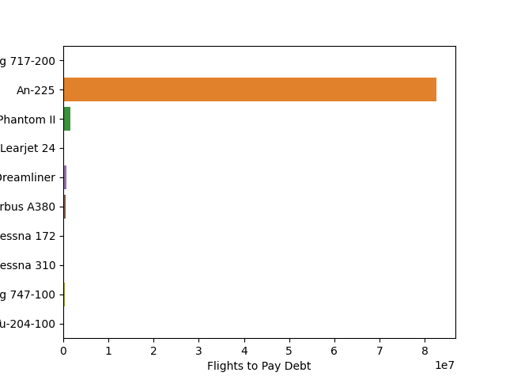

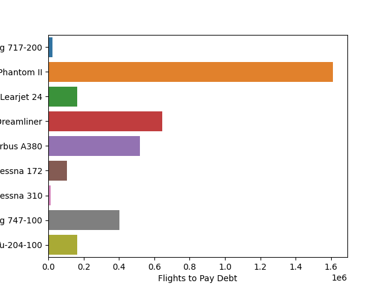

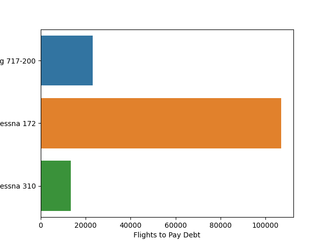

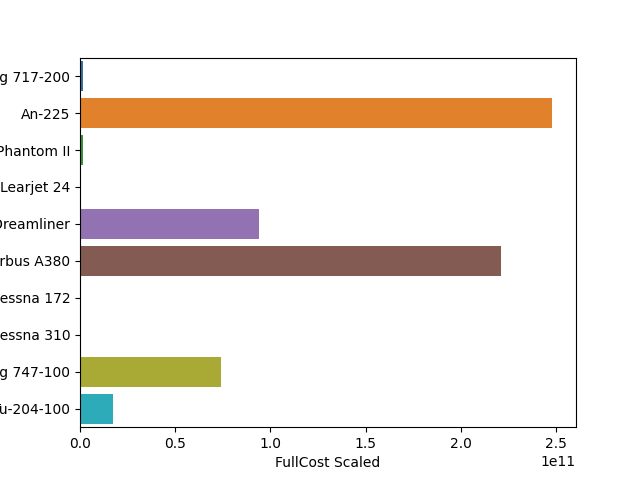

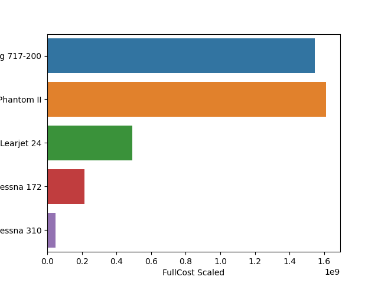

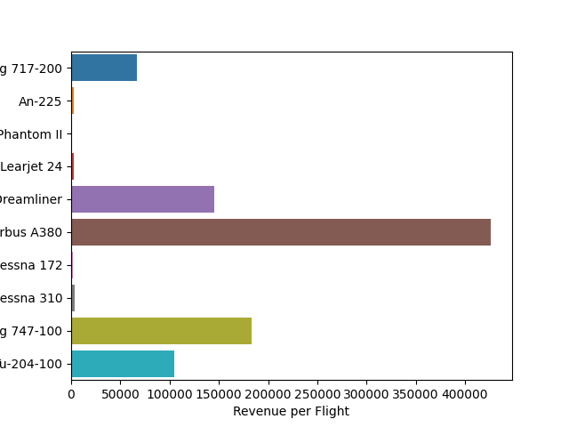

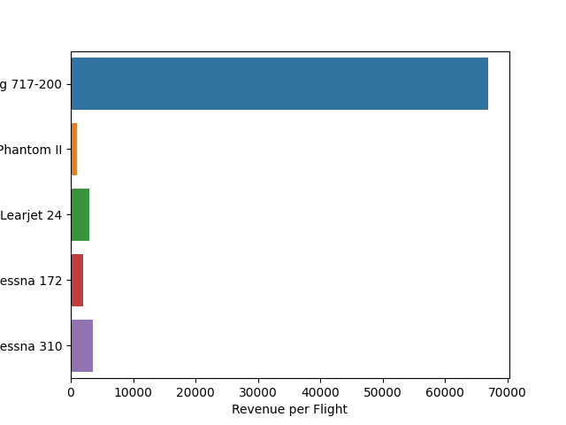

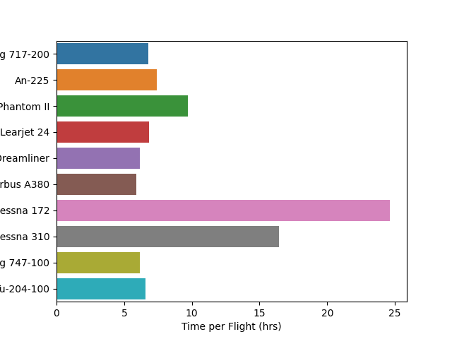

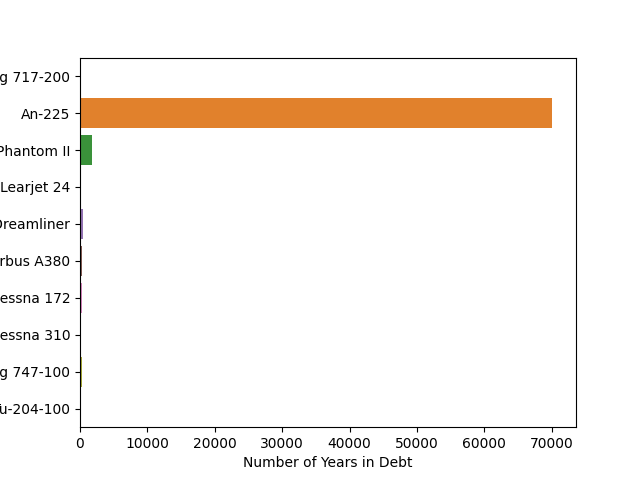

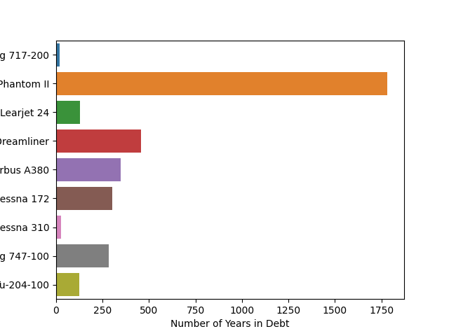

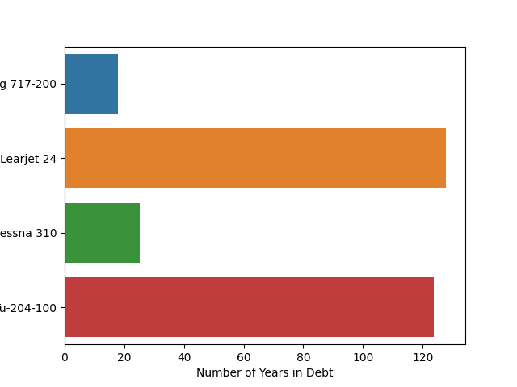

So which plane do we use? Unfortunately the cost of any of these planes is on the scale of at least tens of millions of dollars. Of the 10 options the only planes that are under a billion dollars are the Learjet 172, Cessna 172, and Cessna 310, with the Cessna 310 being under 100 million. Here the scales are so large that discussing specific exact prices is not very useful unless we want to do extra precise calculations for other uses or graphs (which we will not be exploring). Of those three affordable gigaplanes, the most income generating plane is the Cessna 310. So if you are looking for a small budget your best bet would be the Cessna 310. It is also the plane that requires the least flights to fully pay off the debt, at around 12,500 flights, so it would be the quickest and easiest to start earning money with. If you are willing to spend more money, but are still trying to be somewhat cost efficient, the next best option is the Boeing 717-200. It requires the 2nd least number of flights to pay off its debt, at a little over 20,000 flights, produces a sizable enough income per flight (~$67,500), and is the fourth cheapest plane to fully purchase. All other more profitable/revenue generating planes have a full cost of over $100 billion, and require close to 180,000 flights or more to pay off their debt. In our graphs we see overall that the more expensive planes (which also tend to be the larger planes with more seats) tend to produce more revenue but also require much more flights to cancel out their debts. The smaller planes will payout against their debt far quicker than most of the other planes it would seem. Some other minor info we can glean from our graphs are: the small cessna planes take much longer to complete their flights, while all the other planes are within the same hour time frame per flight; the An-225 is extremely price inefficient (which is to be expected since it is a cargo plane, but we are only considering actual real seats in it, which it only has 6 of) and takes almost a millennium to pay off its debt; the most revenue producing plane is the A380; the F-4 phantom II is the second worst plane, but it is a fighter jet with 2 seats.

Overall the bar graphs allow us to see relation in specific aspects of the gigaplanes, but what we care about most is profit. With our current data we can actually construct a graph of line equations with time (in years) as the x input, and profit (in $) as the y output. Our function is linear, in the form y =mx+b or Profit = mt + b. Our y intercept will be the negative cost of the scaled up plane, since it will be the expense. For the slope, we want to find the revenue per unit of time so we can take the revenue per flight and multiply it by the number of flights per hour, or divide by the number of hours per flight. To get the number of hours per flight we can divide the distance per flight by the speed. And since we are working in years, we need to convert the units to match t. This gives a final equation of Profit($)=P(t (yrs))=RevenuePerFlight ($)DistancePerFlight (km)Speed (km/h)*1 day24 hr*1 year365 dayst-CostOfGigaplane if we run our airline 24/7 and never stop flying. After graphing the equations we can see how much profit each plane makes per year and the total cumulative profit each plane will have made after t years. Most notable is we can see how many years each plane will take to pay off its debt. The An-225 has a tiny slope and seems like it will never pay off (or at least within a reasonable amount of time). What is most interesting though is that half of the planes will not become profitable until after 250 years of service. Many of these planes don’t start turning profits (or worthwhile profits compared to other options) for multiple generations, so even if you have billions of dollars on hand, unless you are willing for your success to be gained in future generations, many of the planes are not good choices. I am selfish and want to make as much money as I can for myself within a reasonable time frame. Looking at the graphs, it would seem that my options within a 100 year range come down to the Boeing 717-200 or a Cessna 310. The Boeing 717-200 would still require a small starting investment of around $1 billion, but it would become profitable in just under 20 years, and in 100 years would make just under $7 billion. Since the banks would likely not trust me with a $1 billion loan, it would look like I have to invest in the Cessna 310 Gigaplane. This plane would cost me $50 million, but a few quick An-225 smuggling operations could likely produce enough money. If I did this, profit would start being produced after 22ish years, and after 100 years I would have amassed a fortune of around $135 million. Unfortunately it would seem many of the more profitable planes take too long to produce profit, but for a larger, multi-generational investor, the time investment could prove to be very profitable. I believe these graphs truly do show how profitable the dinosauria aviation market can be though, and shown that there can be affordable dinosaur planes. I hope that this can open up consideration of dinosaur access into other parts of life, but relating specifically to the aviation market, I can definitively say that dinosaur planes are very feasible and realistic.

{: .box-note}
**Note:** Sources: https://www.faa.gov/airports/engineering/aircraft_char_database/data, https://www.trig.com/explore/what-is-the-terminal-velocity-of-a-tyrannosaurus-rex, https://en.wikipedia.org/wiki/Drag_coefficient, https://www.boeing.com/commercial/aeromagazine/aero_19/717_characteristics.pdf, https://archive.aoe.vt.edu/mason/Mason_f/B717PresS07.pdf, https://www.google.com/search?q=how+much+does+it+cost+to+fly+boeing+717-200+for+1+hour&rlz=1C1VDKB_enUS1051US1051&oq=how+much+does+it+cost+&gs_lcrp=EgZjaHJvbWUqBggAEEUYOzIGCAAQRRg7MgYIARBFGDsyBggCEEUYQDIGCAMQRRg5MgoIBBAAGMkDGIAEMgoIBRAAGJIDGIoFMgoIBhAAGJIDGIoFMgYIBxBFGDzSAQg1MzM2ajBqOagCALACAA&sourceid=chrome&ie=UTF-8, https://www.wolframalpha.com/input?i=maximum+calculator&assumption=%7B%22F%22%2C+%22GlobalMaximizeCalculator%22%2C+%22curvefunction%22%7D+-%3E%22%28100x-%28%2810000y*65000%29%2F%28%E2%88%9A%28%282%28%28%2844500y%2B5500x%29*9.81%29-%2821000*y*%28%E2%88%9A%282%29%29*sin%2815%29%29%29%29%2F%280.99*%28%28y*0.0075*35.26%29%2B%28x*0.7*1.2%29%29*%28%E2%88%9A%282%29%29*sin%2815%29%29%29%29%29%29%22, https://www.globalair.com/aircraft-for-sale/specifications?specid=640

##CODE:
  

import math
import matplotlib.pyplot as plt
import numpy as np
import pandas as pd
import seaborn as sns
import csv
from pickletools import read_bytes1

fig, axs = plt.subplots()          # Setting up plot

x = 1    #Number of Planes   -   variable
y = 1    #Number of T-Rexes   -   variable

""" 
Physics based graphs and planes not used in final project
Originally set up a physics equation with f(x, y) -> x and y variables for number of planes and number of Rexes
given an x I wanted to find max f(x, y), and what that y value was, so I set up to for loops to cycle through x and y values (1 to 10000)
and find the max profit. Equation seemed to be wrong as max y value for any x value was y = 10000. Also the equation opens upwards.
Spent a lot of time struggling to make this work, but ultimately didn't owrk - ended up not doing a multiplane section

r = 3.35    #Radius of Plane Fuselage
wingspan = 28.45    #Wingspan
wF = 3.34   #Width of Fuselage
aF = np.pi*(r**2)   #Cross-Sectional Area of Fuselage
aW = 1*(wingspan-wF)    #Cross-Sectional Area of Wing

mP = 44500    #Mass of a Plane
mT = 5000    #Mass of a T-Rex
cdP = 0.0075    #Coefficient of Drag for the Plane
cdT = 0.7    #Coefficient of Drag for the T-Rex
aP = aF + aW    #Cross-Sectional Area of a Plane
aT = 1.2    #Cross-Sectional Area of a T-Rex

m = (x*mP) + (y*mT) #Total mass of planes and T-Rexes

g = 9.81    #Acceleration due to Gravity
p = 0.99    #Density of Air
fP = 95.3 * (10**3)    #Force generated by one plane
theta = math.radians(15)    #Angle Plane Travels at
d = 5570.5  #Distance of Flight
cPPPH = 10000  #Cost Per Plane Per Hour of Flight
cTicket = 100    #Cost of One Ticket

a = 2* ( (m*g) - (fP*x*math.sqrt(2)*math.sin(theta)) )
b = p* math.sqrt(2)* math.sin(theta)* ((x*cdP*aP) + (y*cdT*aT))
speed = math.sqrt(a/b)  #Speed equation

#print(d +", " + cPPPH + ", " + x + ", " + speed)
#print("%f, %f, %f, %f" % (d, cPPPH, x, speed))
#print(d), print(cPPPH)

profitComplex = (d*cPPPH*x) / speed    #Total Cost equation

max = 0
xMax = 0
yMax = 0

for x in range(1,10000):
    for y in range(1,10000):
        m = (x*mP) + (y*mT) #Total mass of planes and T-Rexes
        a = 2* ( (m*g) - (fP*x*math.sqrt(2)*math.sin(theta)) )
        b = p* math.sqrt(2)* math.sin(theta)* ((x*cdP*aP) + (y*cdT*aT))
        speed = math.sqrt(a/b)  #Speed equation

        cTotal = (d*cPPPH*x) / speed    #Total Cost equation
        if(cTotal > max):
            max = cTotal
            xMax = x
            yMax = y
        print((x*10000)+y)
print("(" + str(x) + ", " + str(y) + ")" + ", " + str(max))

#costInput = d*x*cPPPH / speed
#y = x*mC / mT
#profitBasic.append((y*cTicket) - costInput)
"""

PLANE_PATH = "../datasets/PlaneData.csv"
planes = pd.read_csv(PLANE_PATH)

mT = 5000    #Mass of a T-Rex

cTicket = 500    #Cost of One Ticket
d = 5570.5      #Distance of Flight
scale = 496    #Scale for Gigaplane (Human size *scale = Rex size)

cPPPH = 0  #Cost Per Plane Per Hour of Flight
mP = 0    #Mass of a Plane
mTOW = 0    #Mass of Take Off Weight
mC = 0      #Mass of max Payload for Plane or 'Cargo'
speed = 0   #Cruise speed of Plane

#costInput = d*x*cPPPH / speed
#y = x*mC / mT
profitBasic = []#(y*cTicket) - costInput
FullCostScaled = []
FlightDebtCount = []
FlightIncome = []
FlightTime = []
DebtYears = []

with open(PLANE_PATH, "r") as f:
    reader = csv.DictReader(f)

    headers = reader.fieldnames

    for rows in reader:
        
        mC = int(rows["PayloadWeight"])      #Mass of max Payload for Plane or 'Cargo'
        mTOW = int(rows["TOW"])    #Mass of Take Off Weight
        mP = int(rows["PlaneWeight"])    #Mass of a Plane
        cPH = int(rows["CostPerHour"])  #Cost Per Plane Per Hour of Flight
        speed = int(rows["CruiseSpeed (kph)"])   #Cruise speed of Plane
        seats =	int(rows["Seats"])     #Number of seats on Plane
        cP = int(rows["FullCost"])       #Cost of one Plane
        #mCScaled = mC *scale    #Scaled payload for Gigaplane
        cPPScaled = cP *scale   #Scaled cost for Gigaplane
        FullCostScaled.append(cPPScaled)
        FlightDebtCount.append(cPPScaled/(seats*cTicket))
        FlightIncome.append(seats*cTicket)
        FlightTime.append(d/speed)
        DebtYears.append((cPPScaled/(seats*cTicket))/(24/(d/speed))/365)
        #print(cPPScaled/(seats*cTicket))

planes["FullCost Scaled"] = FullCostScaled
planes["Flights to Pay Debt"] = FlightDebtCount
planes["Revenue per Flight"] = FlightIncome
planes["Time per Flight (hrs)"] = FlightTime
planes["Number of Years in Debt"] = DebtYears

sns.barplot(data=planes, y="Plane", x="Flights to Pay Debt", orient="h")
plt.savefig('./img/PlaneFlightDebtCount.png')

sns.barplot(data=planes[planes["Plane"] != "An-225"], y="Plane", x="Flights to Pay Debt", orient="h")
plt.savefig('./img/PlaneFlightDebtCountZoom1.png')

sns.barplot(data=planes[(planes["Plane"] == "Cessna 310") | (planes["Plane"] == "Cessna 172") | (planes["Plane"] == "Boeing 717-200")], y="Plane", x="Flights to Pay Debt", orient="h")
plt.savefig('./img/PlaneFlightDebtCountZoom2.png')

sns.barplot(data=planes, y="Plane", x="FullCost Scaled", orient="h")
plt.savefig('./img/PlaneCost.png')

sns.barplot(data=planes[planes["Plane"] != "An-225"][planes["Plane"] != "Airbus A380"][planes["Plane"] != "Boeing 787 Dreamliner"][planes["Plane"] != "Boeing 747-100"][planes["Plane"] != "Tupolev Tu-204-100"], y="Plane", x="FullCost Scaled", orient="h")
plt.savefig('./img/PlaneCostZoom1.png')

sns.barplot(data=planes, y="Plane", x="Revenue per Flight", orient="h")
plt.savefig('./img/PlaneFlightRevenue.png')

sns.barplot(data=planes[planes["Plane"] != "An-225"][planes["Plane"] != "Airbus A380"][planes["Plane"] != "Boeing 787 Dreamliner"][planes["Plane"] != "Boeing 747-100"][planes["Plane"] != "Tupolev Tu-204-100"], y="Plane", x="Revenue per Flight", orient="h")
plt.savefig('./img/PlaneFlightRevenueZoom1.png')

sns.barplot(data=planes, y="Plane", x="Time per Flight (hrs)", orient="h")
plt.savefig('./img/TimePerFlight.png')

sns.barplot(data=planes, y="Plane", x="Number of Years in Debt", orient="h")
plt.savefig('./img/YearsDebt.png')

sns.barplot(data=planes[planes["Plane"]!="An-225"], y="Plane", x="Number of Years in Debt", orient="h")
plt.savefig('./img/YearsDebtZoom1.png')

sns.barplot(data=planes[(planes["Plane"] == "Cessna 310") | (planes["Plane"] == "Tupolev Tu-204-100") | (planes["Plane"] == "Boeing 717-200") | (planes["Plane"] == "Learjet 24")], y="Plane", x="Number of Years in Debt", orient="h")
plt.savefig('./img/YearsDebtZoom2.png')

t = np.arange(1750)      #time in years

plt.axhline(0, color='black')
plt.axvline(0, color='black')

for index, row in planes.iterrows():
    plt.plot(t, (((row["Revenue per Flight"])/((d/row["CruiseSpeed (kph)"])/(24*365)))*(t) - row["FullCost Scaled"]), label=row["Plane"])
plt.legend(loc=10, bbox_to_anchor=(1.3, 0.5))
plt.show()
plt.savefig('./img/Profit.png')

plt.figure()
t = np.arange(300)      #time in years

plt.axhline(0, color='black')
plt.axvline(0, color='black')

for index, row in planes.iterrows():
    plt.plot(t, (((row["Revenue per Flight"])/((d/row["CruiseSpeed (kph)"])/(24*365)))*(t) - row["FullCost Scaled"]), label=row["Plane"])
plt.legend(loc=10, bbox_to_anchor=(1.3, 0.5))
plt.show()
plt.savefig('./img/ProfitZoom1.png')

plt.figure()
t = np.arange(1750)      #time in years

plt.axhline(0, color='black')
plt.axvline(0, color='black')

for index, row in planes[(planes["Plane"] == "Cessna 310") | (planes["Plane"] == "Tupolev Tu-204-100") | (planes["Plane"] == "Boeing 717-200") | (planes["Plane"] == "Learjet 24")].iterrows():
    plt.plot(t, (((row["Revenue per Flight"])/((d/row["CruiseSpeed (kph)"])/(24*365)))*(t) - row["FullCost Scaled"]), label=row["Plane"])
plt.legend(loc=10, bbox_to_anchor=(1.3, 0.5))
plt.show()
plt.savefig('./img/ProfitLimited.png')

plt.figure()
t = np.arange(300)      #time in years

plt.axhline(0, color='black')
plt.axvline(0, color='black')

for index, row in planes[(planes["Plane"] == "Cessna 310") | (planes["Plane"] == "Tupolev Tu-204-100") | (planes["Plane"] == "Boeing 717-200") | (planes["Plane"] == "Learjet 24")].iterrows():
    plt.plot(t, (((row["Revenue per Flight"])/((d/row["CruiseSpeed (kph)"])/(24*365)))*(t) - row["FullCost Scaled"]), label=row["Plane"])
plt.legend(loc=10, bbox_to_anchor=(1.3, 0.5))
plt.show()
plt.savefig('./img/ProfitLimitedZoom1.png')

plt.figure()
t = np.arange(100)      #time in years

plt.axhline(0, color='black')
plt.axvline(0, color='black')

for index, row in planes[(planes["Plane"] == "Cessna 310") | (planes["Plane"] == "Boeing 717-200") | (planes["Plane"] == "Learjet 24")].iterrows():
    plt.plot(t, (((row["Revenue per Flight"])/((d/row["CruiseSpeed (kph)"])/(24*365)))*(t) - row["FullCost Scaled"]), label=row["Plane"])
plt.legend(loc=10, bbox_to_anchor=(1.3, 0.5))
plt.show()
plt.savefig('./img/ProfitLimitedZoom2.png')

plt.figure()
t = np.arange(100)      #time in years

plt.axhline(0, color='black')
plt.axvline(0, color='black')

for index, row in planes[(planes["Plane"] == "Cessna 310")].iterrows():
    plt.plot(t, (((row["Revenue per Flight"])/((d/row["CruiseSpeed (kph)"])/(24*365)))*(t) - row["FullCost Scaled"]), label=row["Plane"])
plt.legend(loc=10, bbox_to_anchor=(1.3, 0.5))
plt.show()
plt.savefig('./img/ProfitLimitedZoom3.png')
