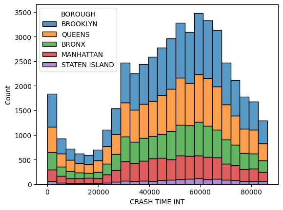

{: .box-note}
**Note:** Collaborator(s) - N/A

{: .box-note}
**Note:** 

**This is my DP lab**

## Dinosaur Planes

The market size, measured by revenue, of the Global Airlines industry was around $841.4bn in 2023. In 2019, there were over 250 million keen flyers traveling in or from the US alone! That’s a lot of people. Yet despite the sheer volume of people flying nowadays, one key demographic has been left unable to fly due to the lack of consideration for accessibility: The Dinosaurs. Many dinosaurs are simply too big or heavy for a plane to carry. Why is this? Some people say this is because the dinosaurs are “extinct”, or because they are “animals” so why would they fly commercial? I disagree with this mentality. Accommodation is important for all and I have taken it upon myself to find a solution to this problem. How can we make commercial flight easily available for the Dinosaurs? How can we make … a Dinosaur plane?

The first step we must take is deciding what dinosaur to use.
Dinosaurs come in a wide variety of shapes and sizes but a specific species makes it easy to consider measurements and estimate values. For our first steps in dinosaur plane construction I think it best to consider a dinosaur more similar to humans, rather than going for the hardest dinosaurs immediately. A velociraptor might seem like a simple easy choice, but it's a bit small. Anything below the size of 3 humans is somewhat pointless to analyze as we could fit them in three aisle seats or stow them as pets. Among the dinosaurs, a T Rex is fairly similar to a human, just scaled up with tiny arms. It’s bipedal and  has an arm length of 3ft. half an average human's wingspan is roughly 3ft (with rounding), so pretty similar arm sizes. Also it’s a T Rex.
Calculations

Now, according to the first and second internet results a T Rex would weigh around 5000 kg to 7000 kg. Wikipedia also says 8.87 metric tons (1 metric ton = 1000 kg). A T Rex is about 11-12 meters long, 1.6-1.9 meters wide, and 3.66-3.96 meters tall (to the hips). This is a wide range of masses and lengths so let’s use whatever’s easiest for us (the lightest and smallest measurements). We can always ask the Rexes to cut down on some weight, tuck their tails in and to lie down.
Also for any human references we will be using a cuboid of dimensions 1.76 meters tall,  0.41 meters wide, and 0.18 meters long.

### Accommodations
Before we get into planes let’s quickly consider some of the accommodations for the Rexes.
Economy class chairs typically weigh around 8-15 kg (18-33 lb.). To scale up from human height to Rex length, we have to multiply by a factor of 6.25, from human width to Rex width, we have to multiply by a factor of 3.9, and for human length to Rex height, we have to multiply by a factor of 20.34. The total scale factor to get the Rex weightherfore is 495.7875 times the human weight. This means we can estimate the seat weight to be 3967.48 kg.
If we want to have a high class commercial plane line we might also want to include some flight food. National Geographic has stated that a T Rex ate 227 kilograms of meat per day. The average plane meal for humans contains around 360 calories, which is 14.4% of a human’s daily intake. For a Rex the proportional amount of meat would then be 32.688 kg.

### Plane 1 - The Real Plane
To start off, let’s consider using a pre-existing plane. The largest plane ever built, a cargo plane, was the Antonov An-225 Mriya. Officially the plane had a max cargo capacity of 200,000kg. By pure mass calculations this means as many as 40 Rexes. That’s not a lot of Rexes. Even worse, the cargo space itself is 6.4 meters wide and 43.5 meters long. So the amount of space for Rexes can fit is 3.9 along the length (if they fold their tails a little we can round to 4) and 4 along the width. That’s around 16 Rexes in the cargo bay. That number is abysmal and sad. This doesn’t even include a seating space or walking area, this is stacking them right next to each other, lying down. Seats would be too heavy and not fit due to height limitations. If we wanted to make space for an aisle, we’d have to reduce the number of dinosaurs to 12. With an hourly cost of $30,000 in flight (not including take-off preparation and loading), this plane would cost $2,500 per dino, per hour. With a cruise speed of 750 km/h, to cross from the US to the UK would be a distance of 6830.07 km. This would take 9.1 hours. For a Rex this travel would cost over $22,766. And unfortunately I don't think T Rexes are making that kinda money. Even if we forget about the aisle the cost per hour would be $1,875 per hour per dino.

How can we save on money then? While there may be many safety rules about humans, pets and even horses on flights, there are not so many for dinosaurs (in fact there are none! Don't fact check). With this we can make use of much unused, previously wasted space on the outside of the plane. This allows us to plaster the Rex on the outside of the plane instead of  having to store them in the cargo bay. The length of the fuselage is about 76.4 meters while the width and height is about 8 meters. If we were to assume the fuselage shape is cylindrical (which it isn't, it's more of a soft-edged cuboid that curves at the end), then the surface area ≈ 2(pi)(4)(76.4) = 1920 m^2. A Rex footprint was about 1 meter long and 0.46 m wide. So total foot area roughly equals 1 m^2 so the dinosaur capacity due to area is around 1,920 Rexes. But that still means only 40 Rexes due to the weight limit. Since we’re not caring about safety, why not also ignore the max cargo capacity? The max take-off weight is actually 640,000 kg, it’s just not a safe take-off weight. Minusing the weight of the plane (285,000 kg) and fuel (15,000 kg) allows for 350,000 kg of Rexes. That’s 70 Rexes! It’s the equivalent of a small plane for humans. Good enough for using a real plane.
Now obviously we can't just stick the Rexes on with magic. We have to use glue or rope to tie their feet down somehow. I think metal rope is the easiest to use and switch out Rexes with so the Rexes will be tightly fastened on with perfectly stable metal cable. I found some metal rope (https://expresswirerope.com/6x36-iwrc-galvanised-wire-rope.html) which costs £3.95 per meter. One circle of the plane in rope will be 25.13 meters, which would cost £99.28, and would be able to contain 15 Rexes. Since we have 16 Rexes in the cargo bay, we have 54 Rexes for the outside. These Rexes would need 4 circles of rope, raising the cost by £626.68. With this the cost per Rex would be between $428.57-442.86 per dino per hour of flight. Still quite expensive per Rex, but much less than prior. We can compensate for some of the less affluent Rexes by tripling the price of the cargo Rexes. They’ve got the best seats after all. If we do this we can also reduce the cost of regular outside seats and increase profits. If we set the regular seats to $300-$200, then the premium seats cost $862.5-$1200 to make even. To make a profit we should require $300/hour for regular, and $1200/hour for premium, giving us an estimated return of $5400/hour of flight. This is still hugely expensive. Even for the regular seats, to travel US to London would cost $2,730. Unfortunately this is as far as our real plane can take us. Unless we switch our commercial airline to a smuggling operation, it is doubtful that any rational Rex would be willing to pay such money.

### The Imaginary Plane(s)
For our first plane we have been considering a real plane that is guaranteed to work. But why? The reason we are constructing this technology is for innovation in the airline sector to open up to the new dinosauria market. While we may want to remain within the realms of feasibility, we can push the envelope in terms of transportation methods. For this reason we can consider two types of imaginary planes: Multiplanes and Gigaplanes. Using these planes we can hopefully set reasonable prices for tickets, for affordable Rex flight, and then maximize profits. The dinosaurs come first, but it doesn't hurt to consider our own interests.

Before Describing these two planar methods, we need some data to analyze. Both of these methods involve using real planes to create a hypothetical plane. Since they are both based on pre-existing planes, we need some data on real planes to compare what is the most effective for each method and determine how the real plane we are basing our imaginary planes on would affect our expected (theoretical) values. For this reason I have constructed a dataset (including data principally from wikepedia) on different planes to use. The data shows the mass of the max payload that the plane can carry, the max takeoff weight, the max takeoff weight minus the weight of the payload (i.e the weight of the plane including fuel), the Cost of renting one of that plane out per hour, and the speed at which it travels.

## Gigaplane
The first imaginary plane involves very straightforwardly scaling up a pre-existing plane to dinosaur scale. 
  




